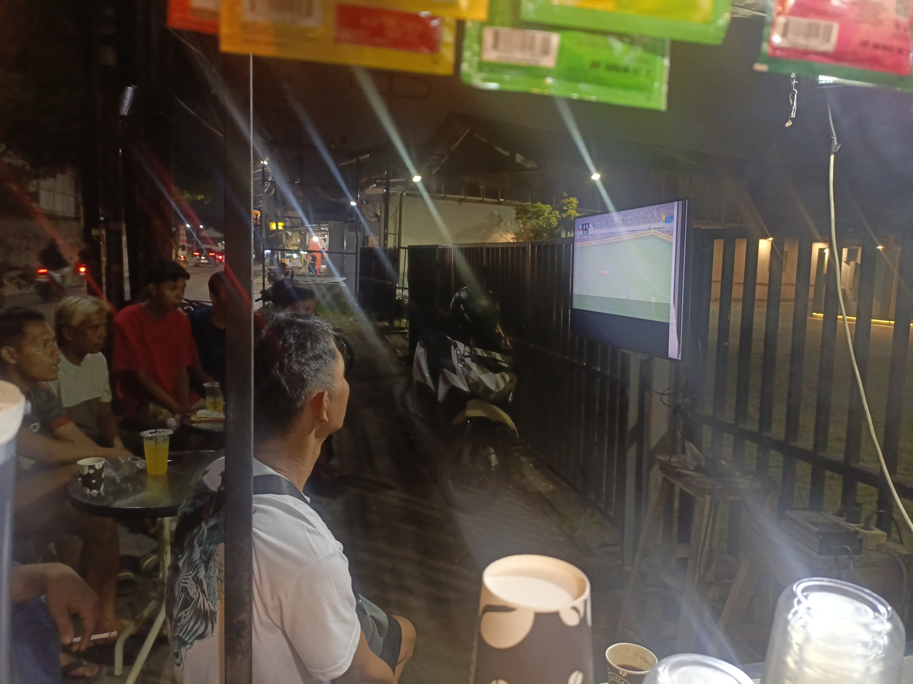

Di sudut Jalan Karang Mulya, tepat di pinggir jalan yang ramai motor dan becak, berdiri sebuah kedai kecil bernama Warkop Yaman. Bukan kedai yang megah. Bukan pula tempat dengan interior mewah atau AC dingin. Ini adalah warung kopi sederhana dengan atap seng, meja plastik, dan kursi lipat. Tapi justru di kesederhanaan itulah, kehangatan yang sesungguhnya tercipta.

## Awal Mula yang Sederhana

Warkop Yaman didirikan oleh Yaman Hermawan pada awal tahun 2025. Idenya simpel saja: menyediakan tempat ngopi murah untuk warga sekitar. Dengan modal seadanya, Yaman mulai berjualan minuman sasetan — kopi sachet, Milo, Chocolatos, teh kotak — ditambah gorengan yang digoreng langsung di tempat. Pisang goreng, tahu goreng, dan aneka gorengan lainnya menjadi teman setia setiap gelas kopi yang disajikan.

> "Saya cuma mau bikin tempat yang enak buat ngobrol. Nggak perlu mahal, yang penting bisa kumpul."

Kata-kata sederhana dari Yaman itu menjadi fondasi dari semua yang terjadi kemudian. Ternyata, warga Karang Mulya memang butuh tempat seperti ini — ruang yang bebas tekanan, tanpa perlu pesan minimum, tempat di mana Anda bisa duduk berjam-jam hanya dengan segelas kopi tiga ribuan.

## Lebih dari Sekedar Kopi

Yang membuat Warkop Yaman berbeda dari warung kopi lainnya bukan soal menu atau harga. Di sini, setiap malam, layar televisi besar menyala untuk nobar — nonton bareng. Pertandingan sepak bola dari liga manapun diputar, dan warga berkumpul. Anak-anak muda, bapak-bapak, bahkan kakek-kakek. Semua duduk berdampingan, memegang gelas masing-masing, berteriak saat gol tercetak.

Ada sesuatu yang magis tentang nobar di pinggir jalan. Angin malam yang sejuk, suara motor yang sesekali lewat, aroma kopi yang bercampur asap gorengan. Ini bukan pengalaman yang bisa Anda dapat di kafe ber-AC atau di depan layar smartphone sendiri. Ini pengalaman komunal — pengalaman yang mengingatkan kita bahwa kita adalah bagian dari sesuatu yang lebih besar dari diri sendiri.

## Dapur Kecil, Rasa Besar

Jangan remehkan dapur Warkop Yaman. Di balik konter kecilnya, tersusun rapi puluhan bungkus Indomie berbagai rasa, stoples kacang, botol sambal, dan tentu saja — tandan pisang yang menggantung. Pisang goreng di sini bukan pisang goreng biasa. Digoreng langsung saat dipesan, dengan tepung yang renyah di luar dan lembut di dalam. Ditambah segelas kopi hitam pahit, dan Anda punya kombinasi yang sempurna untuk malam yang panjang.

Menu Indomie telor juga menjadi favorit. Dengan harga tujuh ribu rupiah, Anda mendapat semangkuk mie panas dengan telur ceplok di atasnya. Sederhana, tapi mengenyangkan dan menghangatkan.

## Ruang Komunitas yang Tumbuh Alami

Warkop Yaman tidak pernah didesain sebagai "community space" dalam artian modern. Tidak ada program komunitas, tidak ada event organizer, tidak ada panitia. Tapi secara alami, tempat ini menjadi ruang di mana warga saling bertemu. Tukang ojek istirahat di sini setelah seharian narik. Pelajar SMA mengerjakan tugas sambil menyeruput Milo hangat. Bapak-bapak diskusi politik dengan volume yang kadang terlalu kencang. Dan semuanya berlangsung di bawah atap seng yang sama.

Itulah keajaiban dari warung pinggir jalan. Ia tidak perlu branding yang keren atau interior yang instagramable. Yang dibutuhkan hanyalah niat baik, kopi yang jujur, dan pintu yang selalu terbuka.
